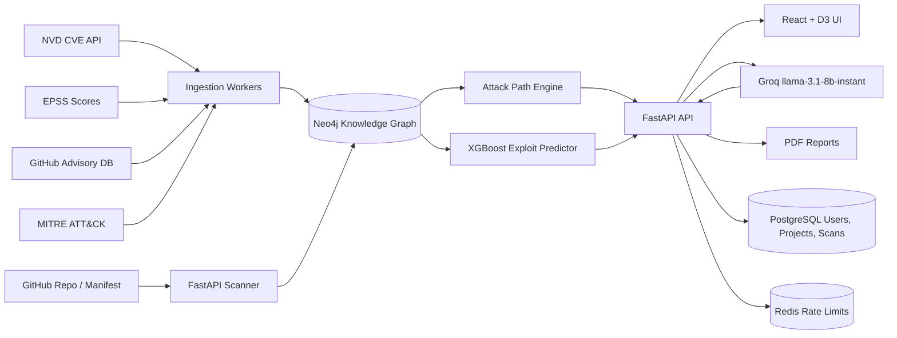

# SecureGraph

AI-powered vulnerability intelligence platform that turns CVE lists into attack paths, patch ROI, exploit prediction, and graph-grounded answers.

Built by Mohammed Saif, MS CS student, Seattle University.

## Architecture



## Quick Start

```bash
cp .env.example .env
docker compose up --build
```

Open:

- Frontend: http://localhost:5173
- Backend docs: http://localhost:8000/docs
- Neo4j browser: http://localhost:7474 (`neo4j` / `password`)

## Real Data Import

Small smoke test with roughly one month of NVD data:

```bash
MONTHS=1 MAX_PAGES=1 ./scripts/import_nvd_data.sh
```

Full two-year import:

```bash
MONTHS=24 ./scripts/import_nvd_data.sh
```

The importer respects NVD rate limits: about 5 requests per 30 seconds without an API key, faster with `NVD_API_KEY`.

## ML Training

Training CSV must include:

`cvss_score, epss_score, age_in_days, cwe_numeric, has_patch, references_count, exploited_in_wild`

```bash
./scripts/train_ml_model.sh backend/core/ml/models/training_data.csv
```

The trained model is saved to `backend/core/ml/models/exploit_predictor.joblib`.

## API Highlights

- `POST /api/auth/register`
- `POST /api/auth/login`
- `POST /api/auth/refresh`
- `POST /api/scans/repo`
- `GET /api/graph/attack-paths`
- `GET /api/graph/remediations`
- `POST /api/llm/query`
- `POST /api/reports/generate`

FastAPI serves full OpenAPI documentation at `/docs`.

## Production Compose

```bash
docker compose -f docker-compose.prod.yml up --build
```

Production mode enables `AUTH_REQUIRED=true`, Redis-backed API limits, service health checks, and resource limits.

## Kubernetes

```bash
kubectl apply -f kubernetes/configmap.yaml
kubectl apply -f kubernetes/deployment.yaml
kubectl apply -f kubernetes/service.yaml
```

## Deployment

The deploy workflow builds backend/frontend Docker images, pushes them to GitHub Container Registry, and can trigger Render/Railway via `RENDER_DEPLOY_HOOK`.

## Screenshot


