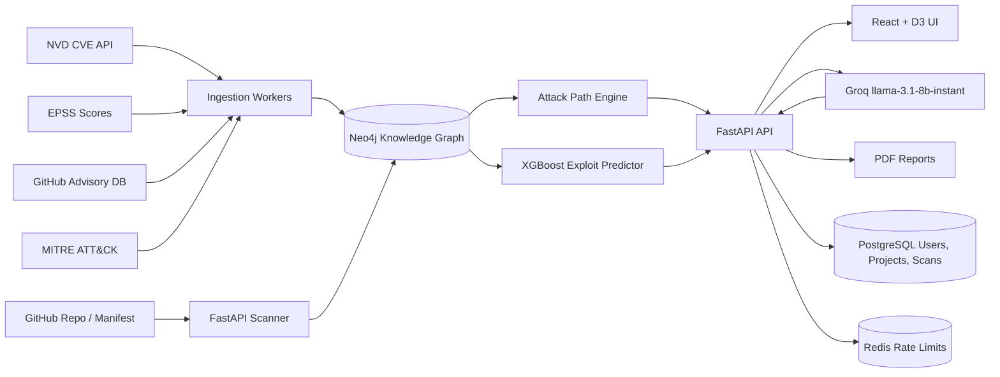
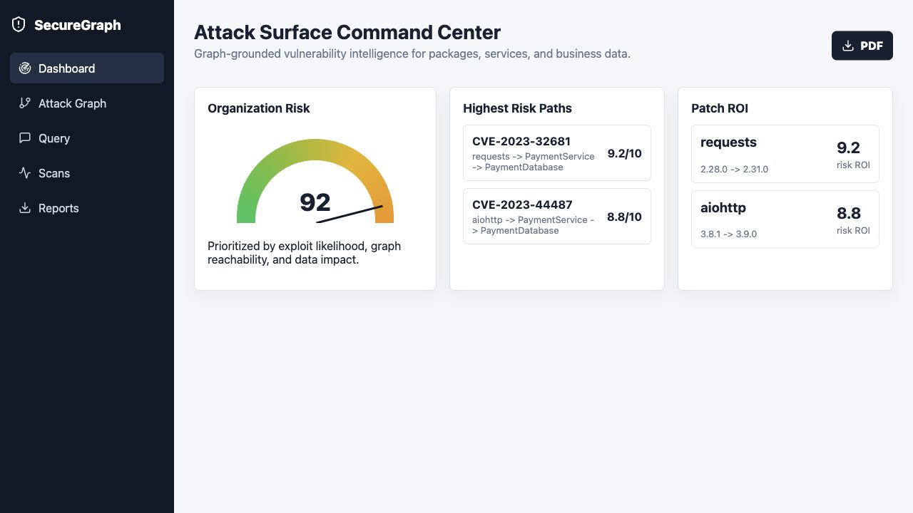

# SecureGraph


SecureGraph is an AI-powered vulnerability intelligence platform that turns CVE lists into attack paths, exploit likelihood, patch ROI, and graph-grounded security answers.

Built by Mohammed Saif, MS CS student, Seattle University.

## Architecture



## Features

- CVE ingestion from NVD API 2.0
- EPSS exploit prediction score enrichment
- GitHub repository scanning for `requirements.txt` and `package.json`
- Neo4j attack graph: CVE -> Package -> Service -> Server -> BusinessData
- Attack path scoring and blast radius analysis
- Patch ROI recommendations
- Groq-powered GraphRAG with context truncation and deterministic fallback
- React + D3 force-directed graph visualization
- PDF report generation
- JWT auth, user projects, scan history, and Redis rate limiting
- Docker Compose local environment and production compose config

## Tech Stack

| Layer | Technology |
| --- | --- |
| Backend | Python, FastAPI, SQLAlchemy |
| Frontend | React, TypeScript, D3.js |
| Graph | Neo4j Community Edition |
| SQL | PostgreSQL |
| Cache / Limits | Redis |
| AI | Groq `llama-3.1-8b-instant` |
| ML | XGBoost |
| DevOps | Docker Compose, GitHub Actions |

## Quick Start

```bash
cp .env.example .env
docker compose up -d --build
```

Open:

- Frontend: http://localhost:5173
- Backend docs: http://localhost:8000/docs
- Neo4j browser: http://localhost:7474 (`neo4j` / `password`)

## Real Data Import

Small smoke test:

```bash
MONTHS=1 MAX_PAGES=1 ./scripts/import_nvd_data.sh
```

Full two-year import:

```bash
MONTHS=24 ./scripts/import_nvd_data.sh
```

The importer respects NVD rate limits: about 5 requests per 30 seconds without an API key, faster with `NVD_API_KEY`.

## API Endpoints

| Method | Endpoint | Purpose |
| --- | --- | --- |
| `GET` | `/health` | Service health |
| `POST` | `/api/auth/register` | Register user |
| `POST` | `/api/auth/login` | Login and receive JWTs |
| `POST` | `/api/auth/refresh` | Refresh JWTs |
| `POST` | `/api/scans/repo` | Queue GitHub repo scan |
| `GET` | `/api/scans` | List scan history |
| `GET` | `/api/scans/{scan_id}` | Scan detail |
| `GET` | `/api/graph/snapshot` | Frontend graph data |
| `GET` | `/api/graph/attack-paths` | Top attack paths |
| `GET` | `/api/graph/remediations` | Patch ROI |
| `POST` | `/api/llm/query` | Graph-grounded AI query |
| `GET` | `/api/reports/pdf` | Download PDF report |
| `POST` | `/api/reports/generate` | Generate executive PDF |

FastAPI serves full OpenAPI docs at `/docs`.

## Screenshots

| Dashboard | Attack Graph | AI Query |
| --- | --- | --- |
| `screenshots/dashboard.png` | `screenshots/attack-graph.png` | `screenshots/query.png` |

Current dashboard preview:



## SecureGraph vs. Snyk

| Capability | SecureGraph | Snyk |
| --- | --- | --- |
| CVE detection | Yes | Yes |
| Attack path graph | Native Neo4j graph | Limited app context |
| Business data reachability | Yes | Not primary focus |
| Patch ROI by blast radius | Yes | Package-focused priority |
| Graph-grounded AI | Yes | Vendor-specific AI features |
| Free local self-hosting | Yes | Limited free SaaS tier |
| Student/hackable architecture | Fully open stack | Closed platform |

## ML Training

Training CSV columns:

`cvss_score, epss_score, age_in_days, cwe_numeric, has_patch, references_count, exploited_in_wild`

```bash
./scripts/train_ml_model.sh backend/core/ml/models/training_data.csv
```

Model output:

`backend/core/ml/models/exploit_predictor.joblib`

## Production Deployment

Production compose:

```bash
docker compose -f docker-compose.prod.yml up -d --build
```

Railway or Render:

1. Create PostgreSQL and Redis services.
2. Set environment variables from `.env.example`.
3. Deploy backend and frontend Docker images.
4. Use Neo4j Aura Free or self-host Neo4j with Docker.
5. Set `AUTH_REQUIRED=true` and a strong `JWT_SECRET`.

The deploy workflow builds Docker images, pushes to GitHub Container Registry, and can trigger Render/Railway via `RENDER_DEPLOY_HOOK`.

## Roadmap

- SBOM upload support for CycloneDX and SPDX
- GitHub App integration for private repo scanning
- Scheduled daily scans and delta reports
- Multi-tenant organization dashboards
- MITRE ATT&CK threat actor overlays
- Jira/Linear remediation ticket sync
- Hosted demo environment

## License

MIT License. See `LICENSE` for details.
